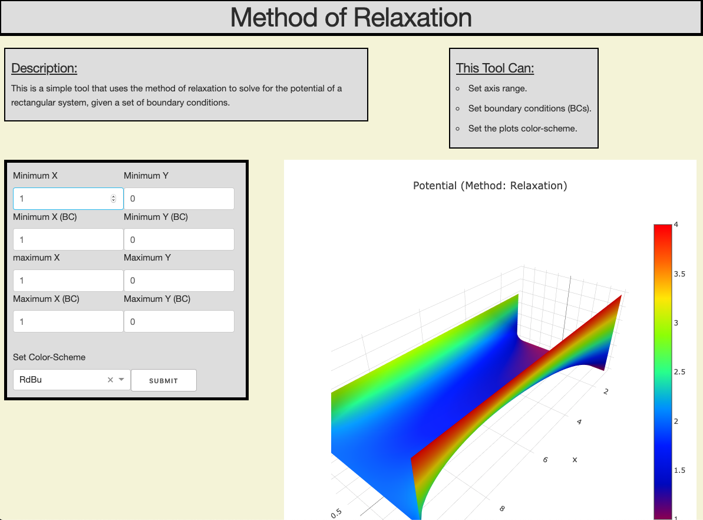

# Method of Relaxation

## Description
This repository contains code for creating a dashboard application
that displays a plot that is associated with a solution to laplaces equation
using the **Method of Relaxation**. 

### Files
1. `Dash-Application.py`: contains the code for the dash 
   application that is used for generating a web page with a 
   dashboard that allows for users to input parameters 
2. `Potential.py`: contains data-structures, as well as the 
   algorithm for the method of relaxation that is used in
   `Dash-Application.py`
3. `How-It-Works.ipynb`: is a jupyter notebook that describes 
   how the method of relaxation works. (I am in the process of writing this file.)
4. `Assets`: Contains the stylesheets that are used in the 
   dash application. 
   
   
### Dash Application

 
 The dash application allows for the user to specify parameters
 associated with a probelm statement, such as the potentials around
 a surface, and the application will than use the `method of relaxation`
 to approximate a solution for the problem.
