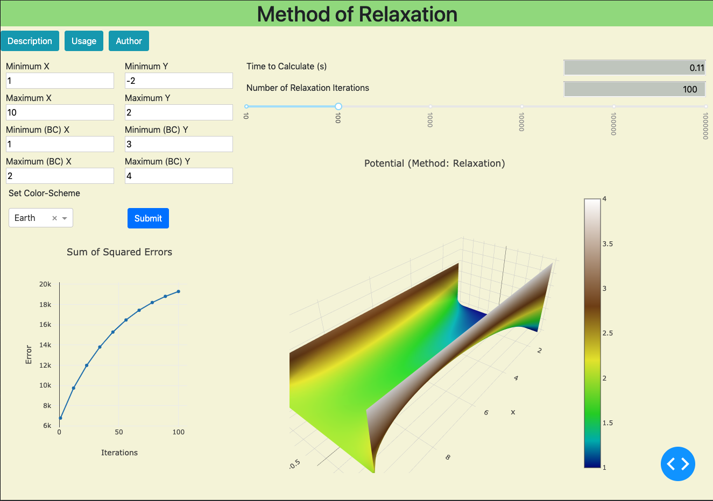

# Method of Relaxation Dashboard 

## Dash Application:


## Description:
This repository contains code for creating a dashboard application
that displays a surface plot that is associated with a solution to laplace's equation
that was computed using the [Method of Relaxation](https://en.wikipedia.org/wiki/Relaxation_(iterative_method)). 

This dashboard application was built using Python's dash library. 
It allows for the user to specify parameters
associated with a particular problem statement. 

The user can set: 
1. Dimensions of the rectangular system.
2. Boundary Conditions around the recangular system. (Currently the user can only specify constant boundary conditions.)
3. The number of relaxation iterations to use.
 
 The program than uses the input parameters to approximate the solution to laplaces equation using the
 **method of relaxation**.

### Dependencies

#### Application / Plot Dependencies
```Bash
pip install dash==1.0.0  # The core dash backend
pip install dash-daq==0.1.0  # DAQ components (newly open-sourced!)
pip install dash-bootstrap-components==0.6.3 # dash bootstrap components
pip install plotly==3.4.2  # plotly graphs
```
#### General Dependencies
```Bash
pip install numpy==1.15.4
```

#### Running The Program
```Bash
python3 Dash-Application.py
```

### Files:
1. `Dash-Application.py`: contains the code for the dash 
   application that is used for generating the dashboard.
2. `Potential.py`: contains data-structures, as well as the 
   algorithm for the method of relaxation that is used in
   `Dash-Application.py`
3. `How-It-Works.ipynb`: is a jupyter notebook that describes 
   how the method of relaxation works. (I am in the process of writing this file.)
4. `Assets`: Contains the stylesheets that are used in the 
   dash application. 
   
